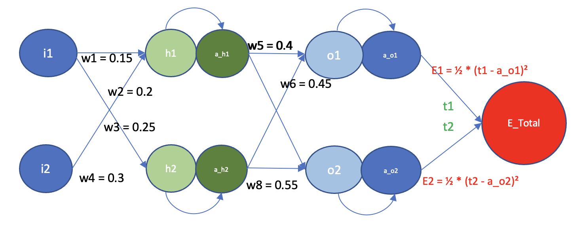
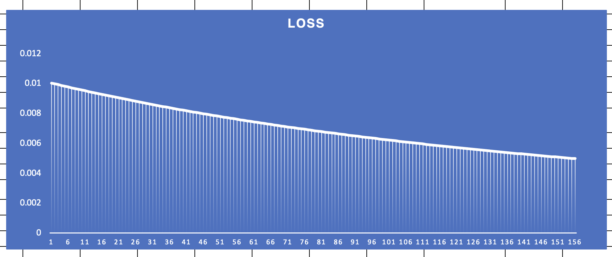
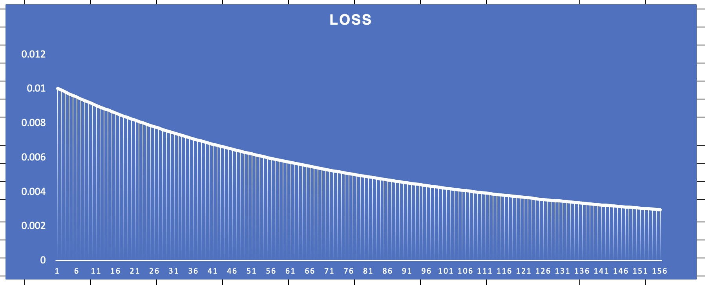
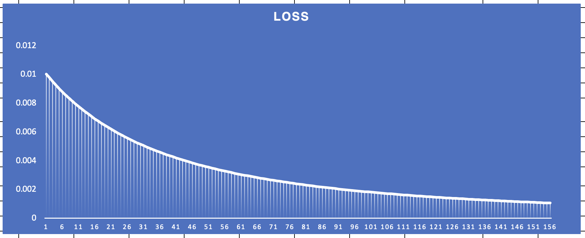
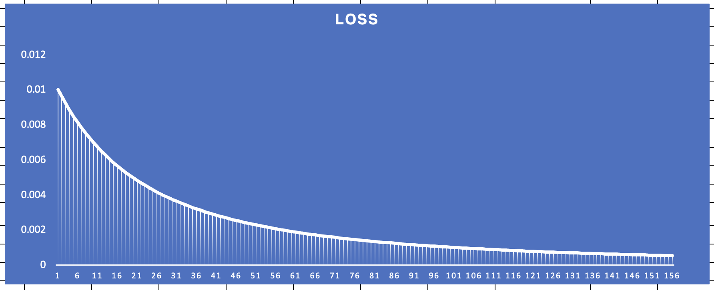
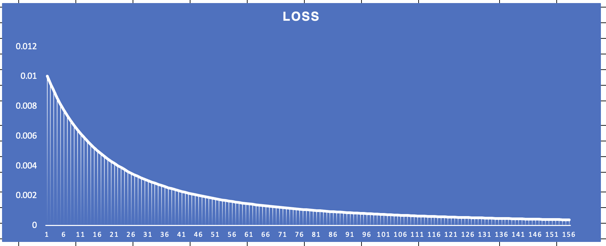
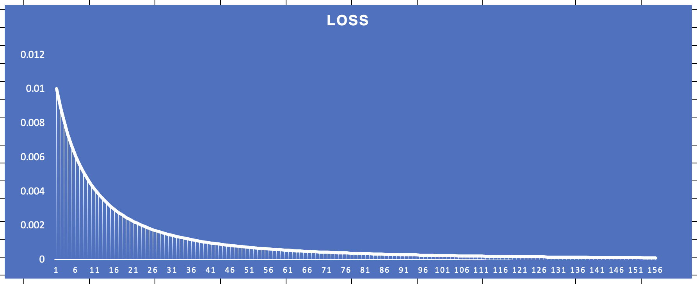

# S6
Welcome to the **Notes** explaining the major steps taken to emulate backpropagationon Excel for a *NN with a single hidden layer*

## Steps for the Process

	1. **Layer Initialisation**: The nodes of the output and hidden layer are filled using the initial parameter values of the 8 weights W1 till W8.
	2. **Loss Calculation**: The error is calculated using the error loss functions *(1/2)(t~1 - a~o~1)* & *(1/2)(t~2 - a~o~2)*.
	3. **BackPropagation**: The partial gradients of loss for each parameter of weight is calculated using the chain rule.
	4. **Updating the Weights** : The weights are updated using the following expression *W~new = W~old - N(del_E/del_W)*.
## Variation of Loss

     

